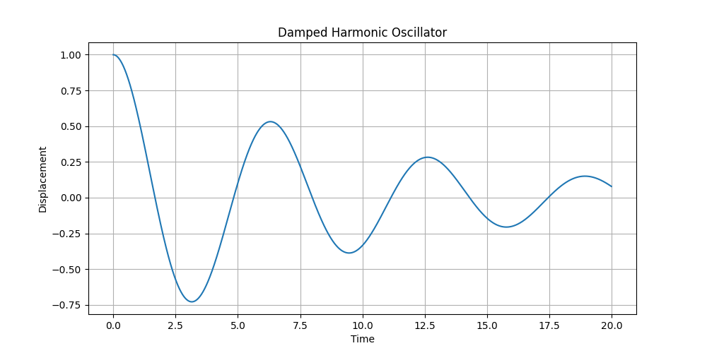
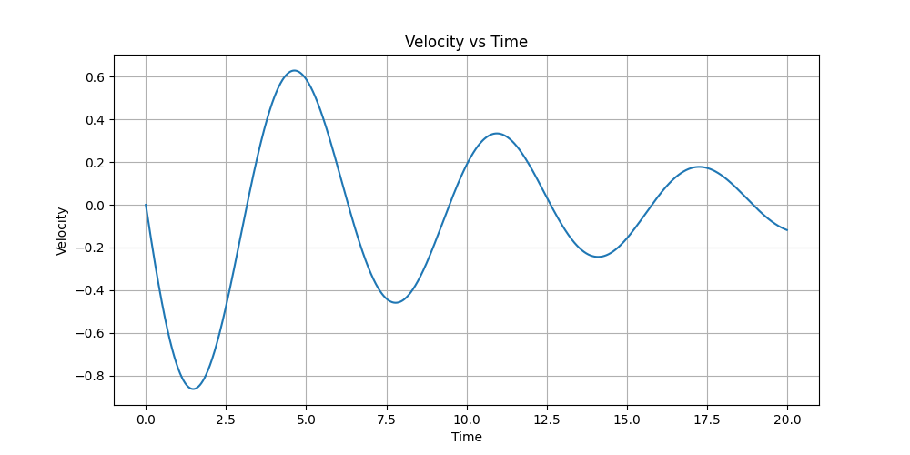
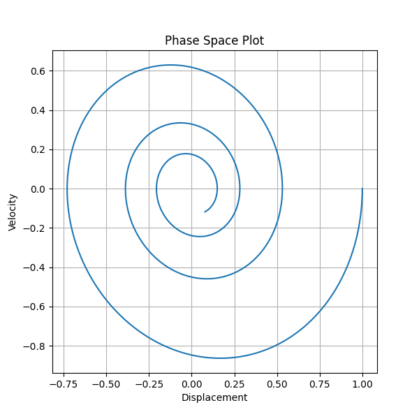

# Computational Physics Oscillator Simulation

## Overview

This project simulates a damped harmonic oscillator using Python, NumPy, and Matplotlib.

The motion of the oscillator is computed numerically using the Euler Method.

---

## Physics Concepts

- Simple Harmonic Motion
- Damped Oscillations
- Numerical Integration
- Phase Space Analysis

---

## Tools Used

- Python
- NumPy
- Matplotlib

---

## Output Graphs

### Displacement vs Time
Shows oscillatory motion with decreasing amplitude due to damping.

### Velocity vs Time
Shows how velocity evolves over time.

### Phase Space Plot
Visualizes the dynamical evolution of the system in phase space.

---

## Future Improvements

- Driven oscillator simulation
- RK4 numerical integration
- Animations

## Sample Outputs

### Displacement vs Time

### Velocity vs Time

### Phase Space Plot
